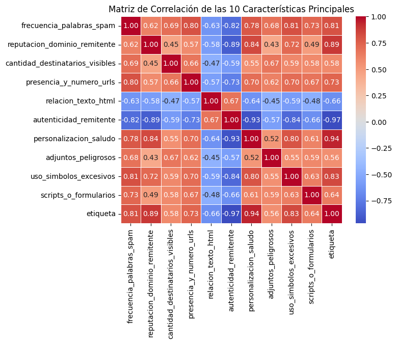
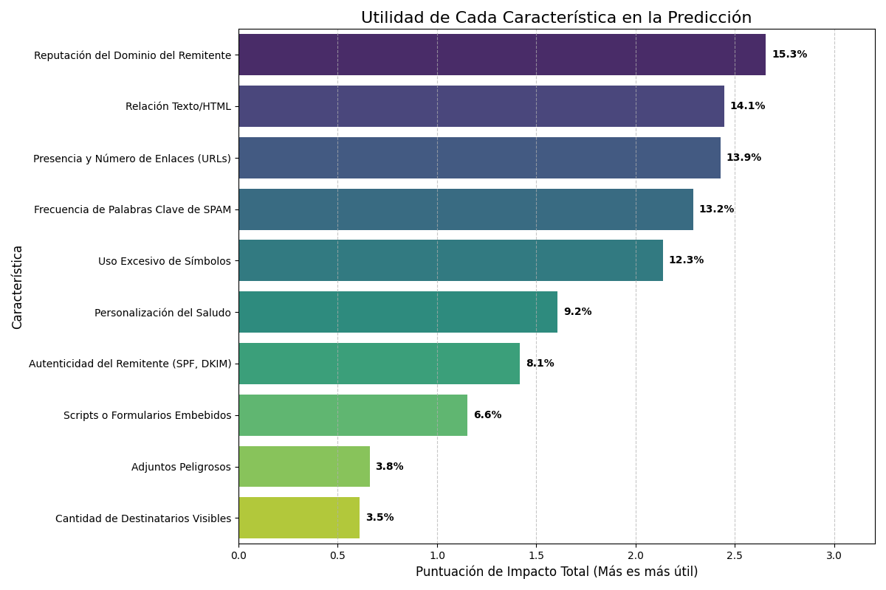
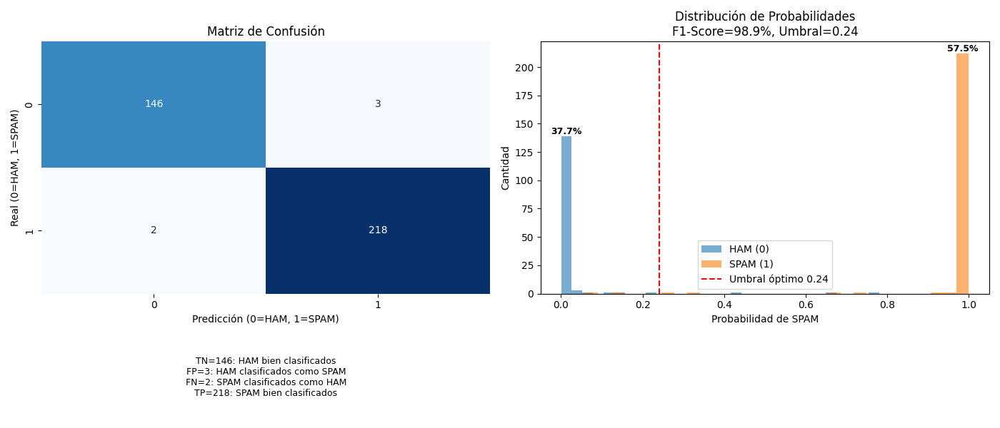
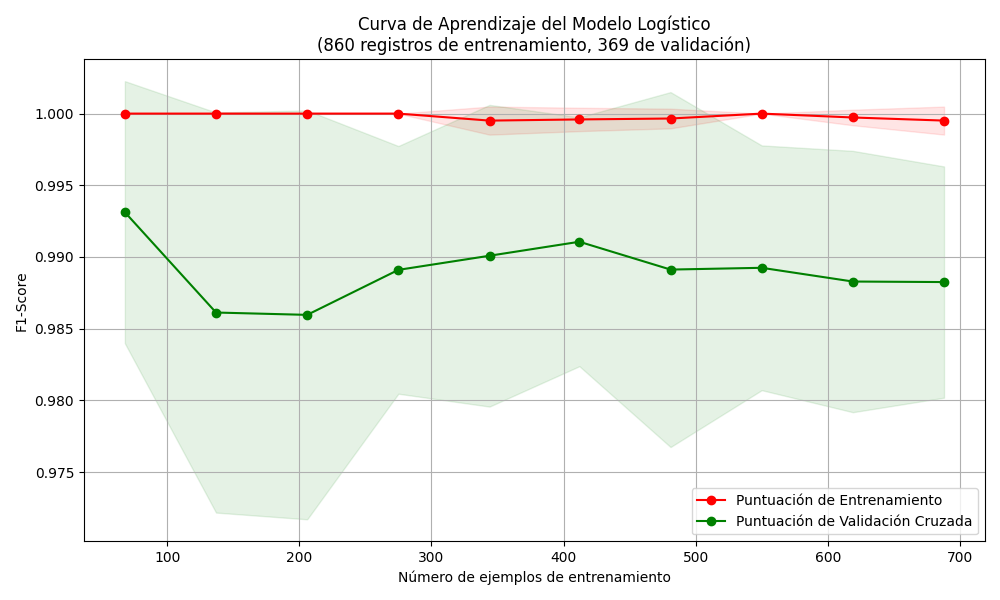

# Informe de Análisis y Clasificación de SPAM

## Modelo de Regresión Logística

**Autores:** Gabriel Esteban Martinez Roldan, Ivone Gisela López Cruz   

**Fecha:** 10 de Septiembre de 2025 

-----

## Índice

1.  [Introducción](#1-introducción)
2.  [Metodología](#2-metodología)
3.  [Análisis de Características](#3-análisis-de-características)
    * [3.1. Análisis de Correlación](#31-análisis-de-correlación)
    * [3.2. Utilidad de las Características para el Modelo](#32-utilidad-de-las-características-para-el-modelo)
4.  [Evaluación del Modelo](#4-evaluación-del-modelo)
    * [4.1. Precisión y Matriz de Confusión](#41-precisión-y-matriz-de-confusión)
    * [4.2. Diagnóstico del Modelo: Curva de Aprendizaje](#42-diagnóstico-del-modelo-curva-de-aprendizaje)
5.  [Conclusiones](#5-conclusiones)
6.  [Repositorio de Código](#6-repositorio-de-código)

-----

### 1\. Introducción

El presente informe expone la construcción y evaluación de un modelo de Machine Learning, específicamente Regresión Logística, con el objetivo de clasificar correos electrónicos como SPAM o HAM (legítimos).  Se analiza un conjunto de datos a partir de 10 características (features) extraídas de cada correo para determinar su naturaleza.  El análisis se centra en dos aspectos clave: la correlación entre las características y la determinación de cuáles de estas características son las más influyentes para que el modelo realice una clasificación correcta. 

### 2\. Metodología

Para abordar el problema, se utilizaron las siguientes 10 características como base para el entrenamiento del modelo: 

1.  Frecuencia de Palabras Clave de SPAM 
2.  Reputación del Dominio del Remitente 
3.  Cantidad de Destinatarios Visibles (To, CC) 
4.  Presencia y Número de Enlaces (URLs) 
5.  Relación Texto/HTML 
6.  Autenticidad del Remitente (SPF, DKIM, DMARC) 
7.  Personalización del Saludo 
8.  Presencia de Archivos Adjuntos Peligrosos 
9.  Uso de Símbolos Especiales y Puntuación Excesiva 
10. Presencia de Scripts o Formularios Embebidos 

Todas las características mencionadas fueron utilizadas en el entrenamiento del modelo.  El conjunto de datos fue procesado y dividido en un 70% para entrenamiento y un 30% para pruebas, asegurando que el modelo fuera evaluado con datos no vistos previamente. 

### 3\. Análisis de Características

#### 3.1. Análisis de Correlación

La matriz de correlación (Figura 1) permite visualizar la relación lineal entre las características antes de entrenar el modelo.  El análisis se centra en la última fila/columna, "etiqueta", que representa la clasificación de SPAM. 

  * **Correlaciones Positivas Fuertes:** Características como 'personalizacion-saludo' (0.94), 'reputacion-dominio-remitente' (0.89) y 'uso-simbolos-excesivos' (0.83) tienen una alta correlación positiva con la etiqueta de SPAM.  Esto significa que un aumento en sus valores (ej. un saludo no personalizado) está fuertemente asociado con un correo malicioso. 
  * **Correlación Negativa Más Fuerte:** La 'autenticidad-remitente' presenta una correlación negativa casi perfecta de -0.97.  Esto indica que un remitente auténtico es el indicador más fiable de que un correo es legítimo (HAM). 

En general, la matriz revela que las características seleccionadas tienen relaciones lineales muy fuertes con la variable objetivo, lo que justifica el excelente rendimiento obtenido con un modelo lineal como la Regresión Logística. 

#### 3.2. Utilidad de las Características para el Modelo

Esta gráfica (Figura 2) desglosa qué características son las más influyentes para el modelo al momento de tomar una decisión, ordenadas por su impacto total. 

  * **Características Dominantes:** La Reputación del Dominio del Remitente (15.3%) es el predictor más fuerte, seguido por la Relación Texto/HTML (14.1%) y la Presencia de URLs (13.9%).  Estas tres características, relacionadas con el origen y la estructura del correo, constituyen más del 40% del poder predictivo del modelo. 
  * **Características de Menor Impacto:** La Cantidad de Destinatarios Visibles (3.5%) y la presencia de Adjuntos Peligrosos (3.8%) son las menos influyentes, aunque siguen aportando valor a la decisión final. 

### 4\. Evaluación del Modelo

#### 4.1. Precisión y Matriz de Confusión

La Figura 3 ofrece una visión dual del rendimiento del modelo: su precisión en la clasificación y la confianza de sus predicciones. 

**Análisis de la Matriz de Confusión:** La matriz muestra un rendimiento excepcional del clasificador. 

  * **Verdaderos Negativos (TN) = 146:** 146 correos legítimos (HAM) fueron correctamente clasificados. 
  * **Verdaderos Positivos (TP) = 218:** 218 correos maliciosos (SPAM) fueron correctamente identificados. 
  * **Falsos Positivos (FP) = 3:** Solo 3 correos legítimos fueron erróneamente marcados como SPAM (Error Tipo I). 
  * **Falsos Negativos (FN) = 2:** Únicamente 2 correos de SPAM lograron pasar el filtro (Error Tipo II), lo cual es un resultado excelente. 

**Análisis de la Distribución de Probabilidades:** El histograma revela por qué el modelo es tan efectivo.  Existe una marcada separación entre las distribuciones para las clases HAM y SPAM.  Los correos HAM (azules) se agrupan cerca de una probabilidad de 0, mientras que los SPAM (naranja) se concentran en 1, indicando que el modelo es muy "seguro" de sus predicciones. 

#### 4.2. Diagnóstico del Modelo: Curva de Aprendizaje

La curva de aprendizaje (Figura 4) es fundamental para diagnosticar si el modelo está bien ajustado. 

  * **Puntuación de Entrenamiento (Roja):** Se mantiene casi perfecta (F1-Score ≈ 1.0), lo que indica que el modelo tiene la capacidad para aprender los patrones de los datos. 
  * **Puntuación de Validación (Verde):** Converge rápidamente hacia una puntuación F1 muy alta y estable (cercana a 0.99), demostrando una excelente generalización a datos no vistos. 
  * **Conclusión:** La gráfica muestra un modelo bien ajustado.  La brecha mínima y constante entre ambas curvas descarta problemas de sobreajuste (overfitting) o subajuste (underfitting). 

### 5\. Conclusiones

El modelo de Regresión Logística implementado demuestra un rendimiento sobresaliente en la clasificación de correos SPAM/HAM, alcanzando un F1-Score del 98.9%.  El análisis de características revela que la reputación del dominio del remitente, la autenticidad y la estructura del contenido (relación texto/HTML y enlaces) son los factores más determinantes.  La evaluación mediante la matriz de confusión confirma una tasa de error extremadamente baja, especialmente en la detección de falsos negativos.  Así mismo, la curva de aprendizaje valida que el modelo está bien ajustado y generaliza eficazmente.  Se concluye que el modelo es efectivo para la tarea propuesta. 

### 6\. Repositorio de Código

Todo el código utilizado para el preprocesamiento de datos, entrenamiento del modelo y generación de las visualizaciones se encuentra disponible en el siguiente repositorio de GitHub: 

[https://github.com/RFGRONA/Machine-Learning-801-IIPA-25.git](https://github.com/RFGRONA/Machine-Learning-801-IIPA-25.git) 