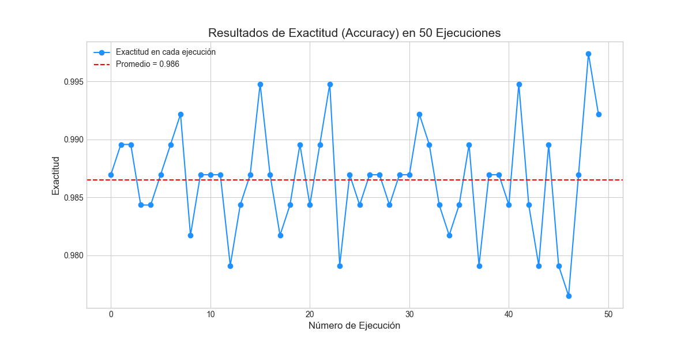
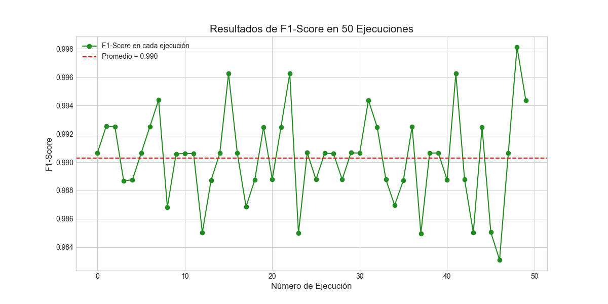
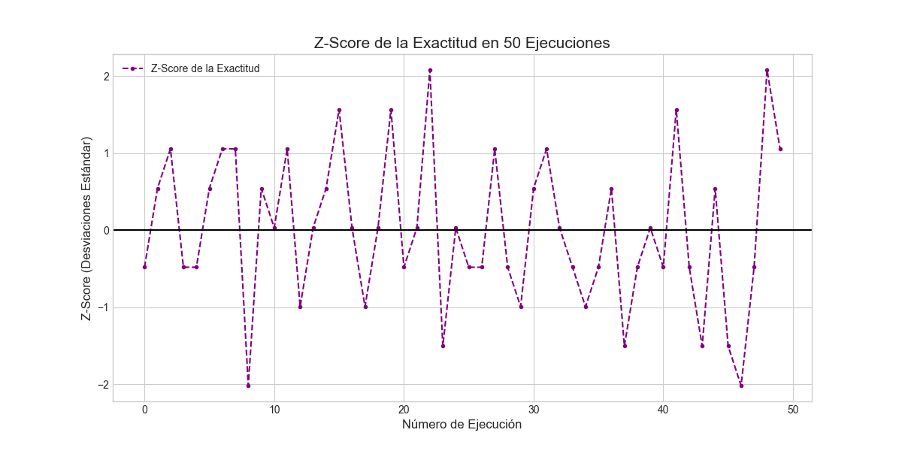
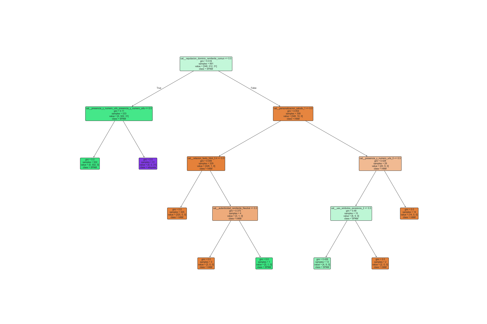

# Clasificador de SPAM/HAM con Árboles de Decisión

* Ivone Gisela Lopez Cruz
* Gabriel Estabn Martinez Roldan

---

## Descripción del Procedimiento

El proceso se desarrolló siguiendo un flujo de trabajo estructurado en varias fases, desde la preparación de los datos hasta la visualización de los resultados, utilizando la librería `scikit-learn` de Python.

### 1. Preparación de Datos
El primer paso consistió en la carga y limpieza del dataset `dataset_correos.csv`. Se realizaron las siguientes transformaciones:
* **Limpieza inicial:** Se descartaron columnas con texto libre como `remitente`, `asunto` o `cuerpo`, para centrar el análisis en las características estructurales del correo.
* **Codificación de la etiqueta:** La variable objetivo `etiqueta` (con valores 'spam' y 'ham') fue transformada a un formato numérico (`0` y `1`) mediante `LabelEncoder` para ser compatible con el modelo.
* **Procesamiento de características:** Las características predictoras se dividieron en numéricas y categóricas. Las características categóricas fueron transformadas usando `OneHotEncoder` para convertirlas en un formato numérico que el modelo pueda interpretar.

### 2. Entrenamiento y Evaluación Iterativa
Para evaluar la robustez del modelo, se implementó un bucle que repite el proceso de entrenamiento y evaluación 50 veces. En cada iteración:
1.  **División de datos:** El dataset se dividió aleatoriamente en un conjunto de entrenamiento (70%) y uno de prueba (30%), utilizando el parámetro `stratify` para asegurar que la proporción de correos SPAM y HAM fuera la misma en ambos conjuntos.
2.  **Entrenamiento:** Se creó y entrenó un nuevo modelo `DecisionTreeClassifier` con los datos de entrenamiento.
3.  **Predicción y Métricas:** El modelo entrenado se usó para predecir las etiquetas del conjunto de prueba. Posteriormente, se calcularon las métricas de Exactitud (Accuracy) y Puntuación F1 (F1-Score).

---

## Resultados Obtenidos

### Métricas de Desempeño Promedio
Tras finalizar las 50 ejecuciones, el rendimiento promedio del clasificador fue el siguiente:

- **Exactitud (Accuracy) Promedio:** `0.9868`
- **Puntuación F1 (F1-Score) Promedio:** `0.9906`

### Gráficas de Desempeño
Las siguientes gráficas visualizan el comportamiento del modelo a lo largo de las 50 pruebas.

#### 1. Resultados de Exactitud (Accuracy)

#### 2. Resultados de Puntuación F1 (F1-Score)

#### 3. Puntuación Z (Z-Score) de la Exactitud

### Visualización del Árbol de Decisión
Se generó una visualización de un árbol entrenado con una profundidad máxima de 4 niveles para interpretar las reglas de clasificación que el algoritmo ha aprendido.

---

## Análisis y Explicación de Resultados

### Interpretación del Rendimiento General
Los resultados numéricos demuestran un rendimiento excepcional del modelo:
* La exactitud promedio de **0.9868** indica que, en promedio, el modelo clasificó correctamente el **98.68%** de los correos en el conjunto de prueba.
* El F1-Score promedio de **0.9906** es una métrica aún más robusta que combina precisión y exhaustividad. Un valor tan cercano a 1.0 sugiere que el modelo es extremadamente bueno tanto en no marcar correos legítimos como SPAM (alta precisión) como en identificar la gran mayoría de los correos SPAM reales (alta exhaustividad).

### Explicación de las Variaciones en los Resultados
Como se observa en las gráficas, aunque el rendimiento promedio es alto, existen fluctuaciones en cada ejecución. Esta variación es completamente normal y se debe al proceso de división aleatoria de los datos (`train_test_split`). Cada una de las 50 ejecuciones entrena el modelo con un subconjunto de datos ligeramente diferente, lo que puede llevar a que algunos conjuntos de prueba sean marginalmente más "fáciles" o "difíciles" de clasificar que otros, causando las variaciones observadas.

### Correlación entre las Gráficas de Métricas
Una observación clave es que las tres gráficas de métricas siguen exactamente la misma tendencia (los picos y valles ocurren en las mismas ejecuciones). Esto no es una coincidencia, sino una confirmación de la consistencia del análisis:

1.  **Relación Exactitud vs. F1-Score:** Ambas métricas se calculan a partir de los mismos resultados de predicción (la misma matriz de confusión) para cada ejecución. Por lo tanto, una ejecución que resulta en una alta exactitud casi siempre resultará en un alto F1-Score. Están fuertemente correlacionadas porque ambas son indicadores de un buen desempeño.

2.  **Relación Exactitud vs. Z-Score:** La gráfica de Z-Score no es una métrica independiente, sino una transformación estadística de los datos de exactitud. La fórmula usada fue:
    $$ Z_i = \frac{\text{Exactitud}_i - \mu_{\text{exactitud}}}{\sigma_{\text{exactitud}}} $$
    Por lo que el Z-Score re-escala los resultados de exactitud, centrando el promedio en 0. Por definición, su gráfica debe tener una forma idéntica a la de la exactitud, mostrando qué tan lejos de la media (en desviaciones estándar) estuvo cada prueba.

---

## Conclusiones

1.  **Eficacia del Modelo:** El algoritmo de Árbol de Decisión (CART) demostró ser una herramienta eficaz y fiable para la clasificación de SPAM/HAM, alcanzando niveles de rendimiento muy altos de manera consistente.

2.  **Estabilidad Comprobada:** La estrategia de repetir el experimento 50 veces confirmó la estabilidad del clasificador. A pesar de las variaciones naturales por el muestreo aleatorio, el rendimiento general se mantuvo dentro de un rango predecible y alto.

3.  **Transparencia e Interpretabilidad:** Una de las mayores ventajas de este modelo es su transparencia. La visualización del árbol de decisión permite comprender las reglas exactas que el modelo utiliza, lo cual es util para entender su lógica interna.

4.  **Consistencia del Análisis:** La fuerte correlación observada entre las gráficas de métricas valida la coherencia del proceso experimental, confirmando que los resultados son lógicos y esperados desde una perspectiva estadística.